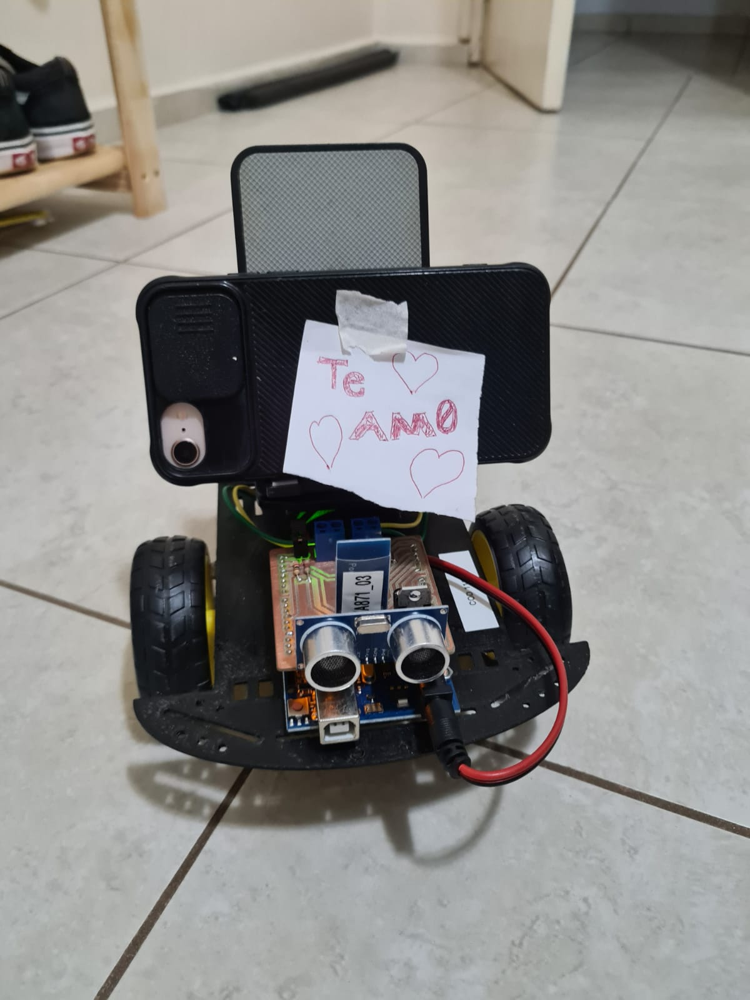
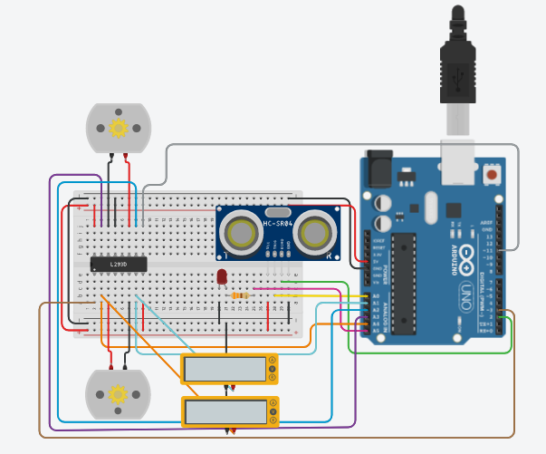

# CarLo-Eco

CarLo-Eco (Carro com Localização baseada em Eco) é um projeto de carrinho que utiliza um sensor de distância para evitar obstáculos. O carrinho é controlado por um microcontrolador Arduino, com ATmega328P. 

## Simulação

A simulação pode ser feita por meio do simulador presente no [Tinkercad](https://www.tinkercad.com/things/i7Rg0eiGFPW-ea871-2s2023-projeto-final)

